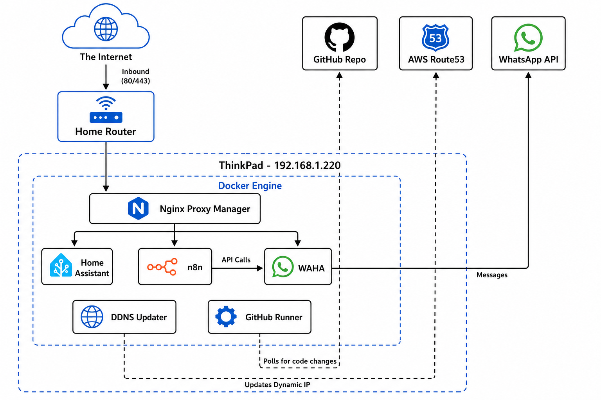

# HomeLab

Docker Compose definitions for the self-hosted services running on my home server. One folder per service under `docker/`. There is no build step — each service is deployed independently with `docker compose up -d` from its own directory.

## Services

| Service | Purpose | Ports |
|---|---|---|
| [n8n](docker/n8n) | Workflow automation | 5678 (behind reverse proxy on 443) |
| [nginx-proxy-manager](docker/nginx-proxy-manager) | Reverse proxy + TLS termination | 80, 443, 81 (admin) |
| [ddns-updater](docker/ddns-updater) | Keeps dynamic DNS records in sync with the WAN IP | 8000 |
| [waha](docker/waha) | WhatsApp HTTP API | 3000 |
| [avail-spot-finder-bot](docker/avail-spot-finder-bot) | Telegram bot (image built out-of-band) | — |

## Network setup & flow



The lab runs on a single ThinkPad host (`192.168.1.220`) on the home LAN. All public traffic is funnelled through the home router and terminates at Nginx Proxy Manager; everything else is east-west between containers on the Docker network.

**Inbound (Internet → services)**

1. Home router forwards `80/443` to ThinkPad `192.168.1.220`.
2. Nginx Proxy Manager terminates TLS and reverse-proxies to the right container by hostname:
   - `n8n` (workflow editor / webhooks)
   - `waha` (WhatsApp HTTP API)
   - Home Assistant (deployed separately, not in this repo)
3. Containers reach each other directly over the Docker bridge for API calls — n8n calls Home Assistant and WAHA without going back out through the proxy.

**Outbound (services → Internet)**

- `ddns-updater` polls the WAN IP and updates the **AWS Route 53** record so `${HOSTNAME}` keeps resolving to the home router after an ISP IP change.
- `waha` maintains a long-lived session to the **WhatsApp** servers; inbound messages arrive on that session, not via the reverse proxy.
- A GitHub Actions self-hosted runner (also deployed outside this repo) polls **GitHub** for jobs targeting the homelab.

**Not in the diagram:** `avail-spot-finder-bot` runs on the same host but only talks outbound to Telegram, so it doesn't appear in the inbound flow.

## Conventions

- Secrets live in a `.env` file next to each `docker-compose.yml` and are gitignored. Variables used: `HOSTNAME`, `N8N_ENCRYPTION_KEY`, `BOT_TOKEN_SECRET`, `GPG_SECRET`, `WAHA_SECRET`.
- Persistent data is bind-mounted under the host user's home directory (`${HOME}/...`).
- External HTTPS goes through `nginx-proxy-manager`; other services should not bind 443 directly.

## Deploy a service

```bash
cd docker/<service>
docker compose up -d
```

## Disaster recovery

n8n credentials are encrypted with `N8N_ENCRYPTION_KEY` — back up that key alongside the workflow/credential JSON exports. Full restore procedure: [`docker/n8n/restore.md`](docker/n8n/restore.md).
